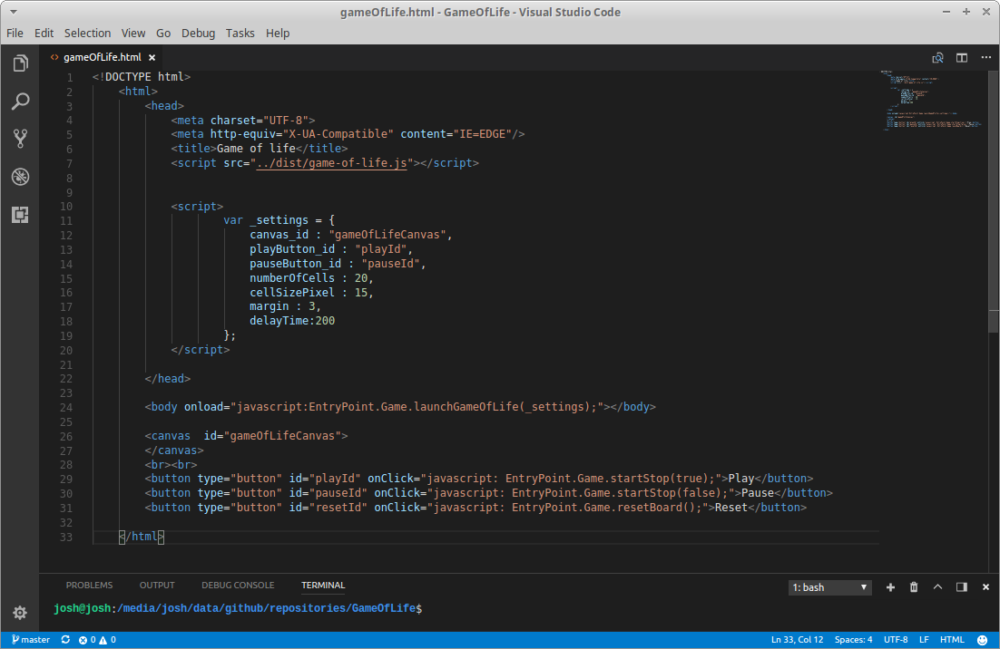

# The Game Of Life

The Game of Life, also known simply as Life, is a cellular automaton devised by the British mathematician John Horton Conway in 1970.
Rules

The universe of the Game of Life is an infinite two-dimensional orthogonal grid of square cells, each of which is in one of two possible states, alive or dead, or "populated" or "unpopulated". Every cell interacts with its eight neighbours, which are the cells that are horizontally, vertically, or diagonally adjacent. At each step in time, the following transitions occur:

* Any live cell with fewer than two live neighbours dies, as if caused by underpopulation.
* Any live cell with two or three live neighbours lives on to the next generation.
* Any live cell with more than three live neighbours dies, as if by overpopulation.
* Any dead cell with exactly three live neighbours becomes a live cell, as if by reproduction.

The initial pattern constitutes the seed of the system. The first generation is created by applying the above rules simultaneously to every cell in the seed—births and deaths occur simultaneously, and the discrete moment at which this happens is sometimes called a tick (in other words, each generation is a pure function of the preceding one). The rules continue to be applied repeatedly to create further generations.

## Setting up
You must configure the input parameters.
```javascript
   var _settings = {
     canvas_id : "gameOfLifeCanvas",
     playButton_id : "playId",
     pauseButton_id : "pauseId",
     numberOfCells : 20,
     cellSizePixel : 15,
     margin : 3,
     delayTime:200
   };
```
## Description
* **canvas_id**: identifier of the canvas that will be defined in the html document.
* **playplayButton_id:** identifier of the button that will be used to start the game.
* **pauseButton_id:** identifier of the button that will serve to pause the game at any time.
* **numberOfCells:** defines the number of cells in the board of [N x N].
* **cellSizePixel:** defines the size of each of the cells in the grid.
* **margin:** defines the margin between the generated cell and the fill.
* **delayTime:** determines the speed in milliseconds of the change between states.


<p align="center"></p>

<p align="center"></p>


